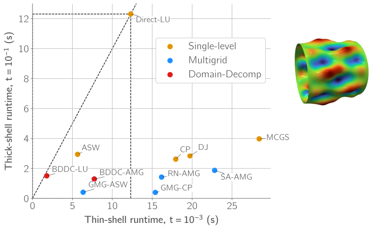
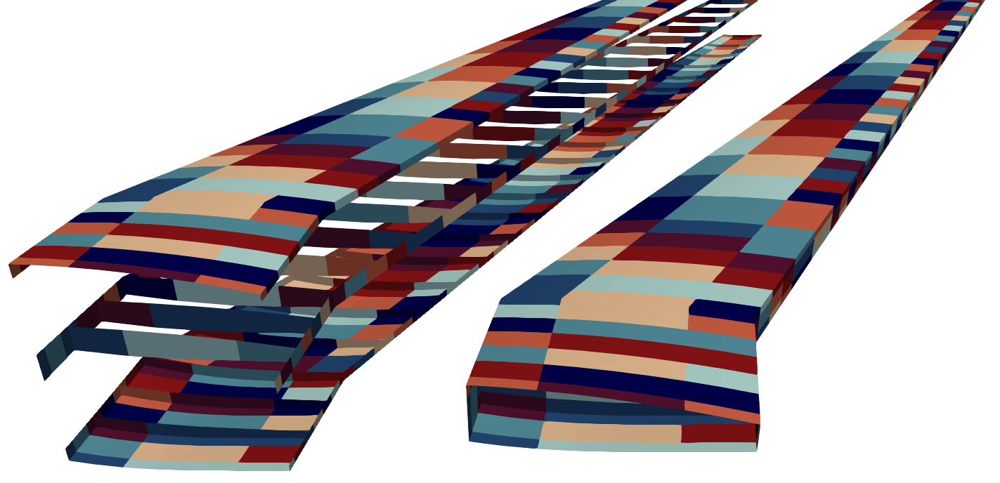

# GPU-Accelerated Finite Element Analysis

**Authors:** Sean Engelstad, Graeme Kennedy  

A scalable **GPU-accelerated finite element analysis (FEA)** framework for beams, plates, and shell structures.

This project is a **GPU-focused development of TACS (Toolkit for the Analysis of Composite Structures)**, extending it to leverage modern GPU architectures for large-scale structural simulations.

See the [TACS github repo](https://github.com/smdogroup/tacs) for the original CPU-parallel implementations.

---

## Features

- GPU-based finite element assembly and solvers  
- Support for beam, plate, and shell elements (Reissner–Mindlin)  
- Multi-GPU capability  
- Solves **millions of DOFs in < 1 second** (problem dependent)  
- Adjoint-based structural optimization for wingbox problems  
- Aeroelastic analysis capability  
- **14+ state-of-the-art linear solvers implemented**  
- Focus on thin-shell and wingbox structural analysis  

---

## Large Comparison Study of GPU Linear Solvers for Reissner-Mindlin Shells

Compared 14 state of the art linear solvers for GPU-accelerated runtime on thick and thin Reissner-Mindlin shells. Many solvers break down in thin shells and are not as practical for high DOF problems. The following are some key observations.

- **Additive Schwarz (ASW)** and **Balancing Domain Decomposition by Constraints (BDDC)** methods perform well for thin shells due to improved resolution of node-to-node locking defects.

- Standard multigrid prolongation operators exhibit **zero-strain subspace mismatch**, degrading thin-shell performance.

- **GMG-ASW remains a strong smoother**, especially outside the extreme thin-shell regime.

- A new **BDDC wraparound subdomain strategy** is introduced for wingbox structures, improving robustness and scalability.

  

  

### Novel BDDC Wingbox Wraparound Subdomains 
* New subdomain splitting method for Multi-Patch High DOF Wingbox Structures beats multigrid for high DOF wing problems.
* 8x or 100x loss in thin shell performance if not using wraparound subdomains.

  

---

---

## Supported Linear Solvers

| Category | Solver | Description | Ref |
|----------|--------|-------------|-----|
| **Baseline** | Direct-LU | Sparse direct LU factorization | [1] |
| **Smoothers / Preconditioners** | ILU | Incomplete LU factorization | [1,2] |
|  | Damped Jacobi | Diagonal smoother | [1] |
|  | Multicolor Gauss-Seidel | Parallel GS smoother | [1] |
|  | Chebyshev Polynomial | Polynomial smoother | [3] |
|  | SPAI | Sparse approximate inverse | [4] |
|  | Additive Schwarz | Overlapping domain decomposition | [5] |
| **Geometric Multigrid** | GMG-CP | GMG + Chebyshev smoothing | [5,6] |
|  | GMG-ASW | GMG + Additive Schwarz smoothing | [5,6] |
| **Algebraic Multigrid** | CF-AMG | Classical AMG | [5] |
|  | SA-AMG | Smoothed aggregation AMG | [7,8] |
|  | RN-AMG | Root-node AMG | [9] |
| **Domain Decomposition** | BDDC-LU | BDDC + LU coarse solve | [10,11] |
|  | BDDC-AMG | BDDC + AMG coarse solve | [10,11] |
|  | Multilevel BDDC | Hierarchical BDDC | [12] |

---

## References

[1] Saad, Y. *Iterative Methods for Sparse Linear Systems*, 2nd ed., SIAM, 2003.  
https://www-users.cse.umn.edu/~saad/IterMethBook_2ndEd.pdf  

[2] Anderson, W. K., Wood, S., Jacobson, K. E.  
“Node Numbering for Stabilizing ILU Preconditioners,” AIAA, 2020.  
https://doi.org/10.2514/6.2020-3022  

[3] Lottes, J.  
“Optimal Polynomial Smoothers for Multigrid V-cycles,” *Numerical Linear Algebra Appl.*, 2023.  
https://doi.org/10.1002/nla.2518  

[4] Chow, E., Saad, Y.  
“Approximate Inverse Preconditioners via Sparse-Sparse Iterations,” *SIAM J. Sci. Comput.*, 1998.  
https://doi.org/10.1137/S1064827594270415  

[5] Trottenberg, U., Oosterlee, C., Schüller, A.  
*Multigrid: Basics, Parallelism, and Adaptivity*, Academic Press, 2001.  

[6] Fish, J., Belsky, V., Gomma, S.  
“Unstructured Multigrid Method for Shells,” *IJNME*, 1996.  
https://www.columbia.edu/cu/civileng/fish/Publications_files/multigrid1996.pdf  

[7] Vaněk, P., Mandel, J., Brezina, M.  
“Smoothed Aggregation AMG,” *Computing*, 1996.  
https://doi.org/10.1007/BF02238511  

[8] Mandel, J., Brezina, M., Vaněk, P.  
“Energy Optimization of AMG Bases,” *Computing*, 1999.  
https://doi.org/10.1007/s006070050022  

[9] Manteuffel, T. A., Olson, L. N., Schroder, J. B., Southworth, B. S.  
“Root-Node AMG,” *SIAM J. Sci. Comput.*, 2017.  
https://doi.org/10.1137/16M1082706  

[10] Beirão da Veiga, L., et al.  
“BDDC for Naghdi Shell Problems,” *Computers & Structures*, 2012.  
https://doi.org/10.1016/j.compstruc.2012.03.015  

[11] Li, J., Widlund, O. B.  
“FETI-DP, BDDC, and Block Cholesky Methods,” NYU, 2004.  
https://cs.nyu.edu/~widlund/li_widlund_041211.pdf  

[12] Hanek, M., Šístek, J., Burda, P.  
“Multilevel BDDC,” *SIAM J. Sci. Comput.*, 2020.  
https://doi.org/10.1137/19M1276479  

---