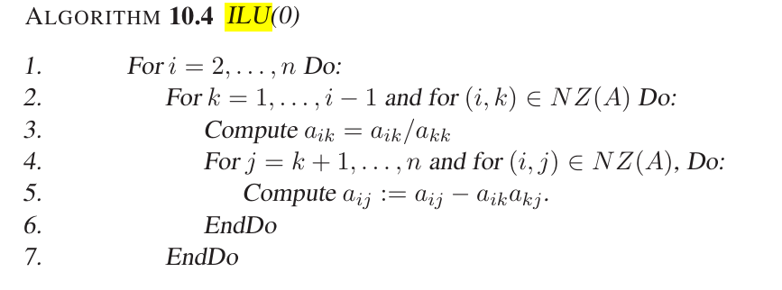
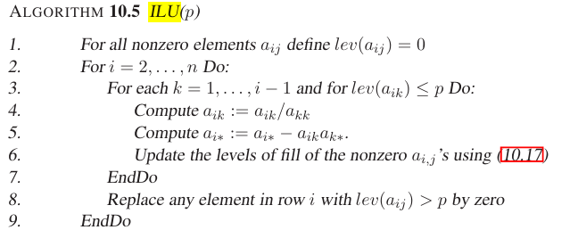

# ILU(k) 
Incomplete LU factorizations to precondition the matrix-equation linear solve $A x = b$ to $M^{-1} A x = M^{-1} b$. 
* once we have a reordering that minimzies bandwidth, how do we find the ILU(k) e.g. ILU(0) (no-fillin), ILU(1) 1st level fillin, etc. 
- [ ] [Saad book, Iterative Methods for Sparse Linear Systems](https://www-users.cse.umn.edu/~saad/IterMethBook_2ndEd.pdf)

* how to apply an ILU $A \approx LU = M$ as a preconditioner
    * compute $M = LU \approx A$ an incompelte LU decomposition.
    * then compute $M^{-1} b$ and $M^{-1} A$. If matrix-free methods, then I think you can just compute matrix products $M^{-1} y$ where $y_k = M^{-1} z_k$, $z_k = A y_{k-1}$ recursively with, $z_0 = M^{-1} b$ (just matrix vector products).

* ILU(0) algorithm:
    * goal is to find $L,U$ such that the residual matrix $R = LU - A$ has the same nonzero pattern of $A$ (no fill-in)
    * then you can use the approximate matrix $A \approx M$ where $M = LU$ as a preconditioner for the original matrix iterative solve.
    
    * often this algorithm the ILU(0) doesn't have enough fillin and you can't 

* ILU(k) or ILU(p) algorithm:
    
    * not easy to predict how long the ILU(k) fillin will take.
    * Cusparse has an efficient way to do the numerical ILU(0) fillin
        * so maybe I need to do the ILU(k) symbolic fillin myself then?